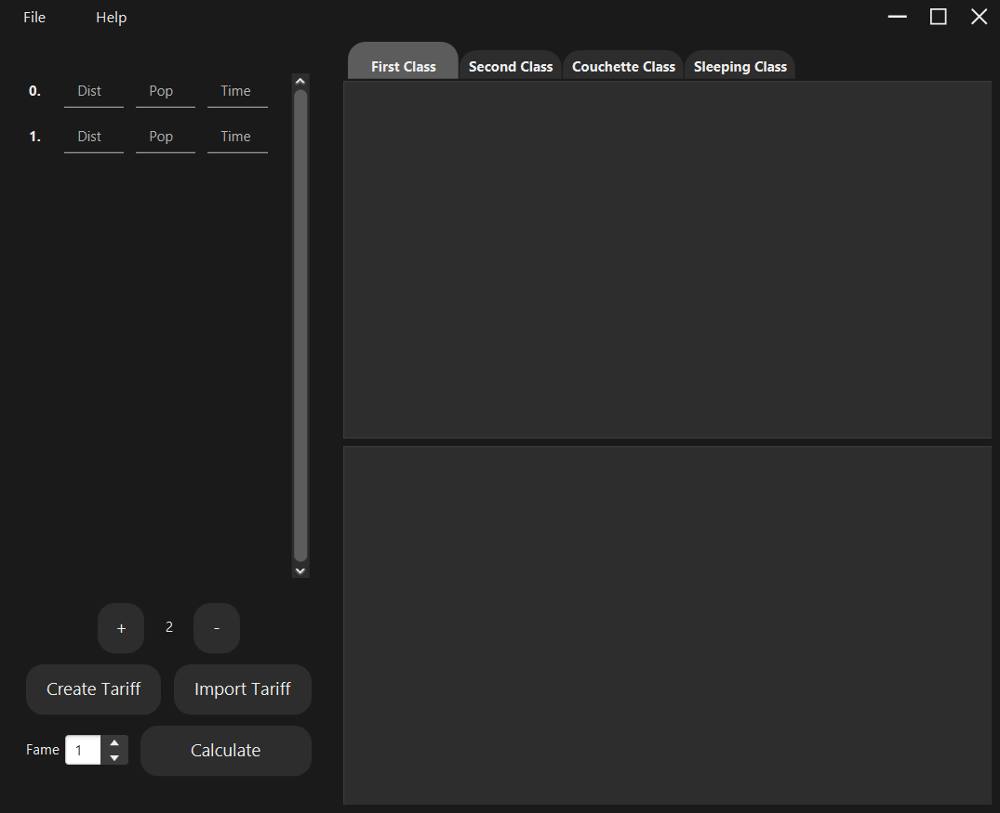
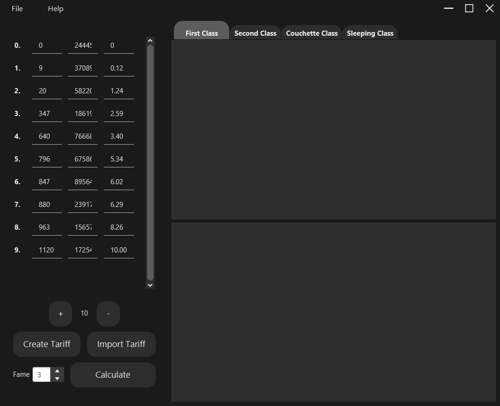
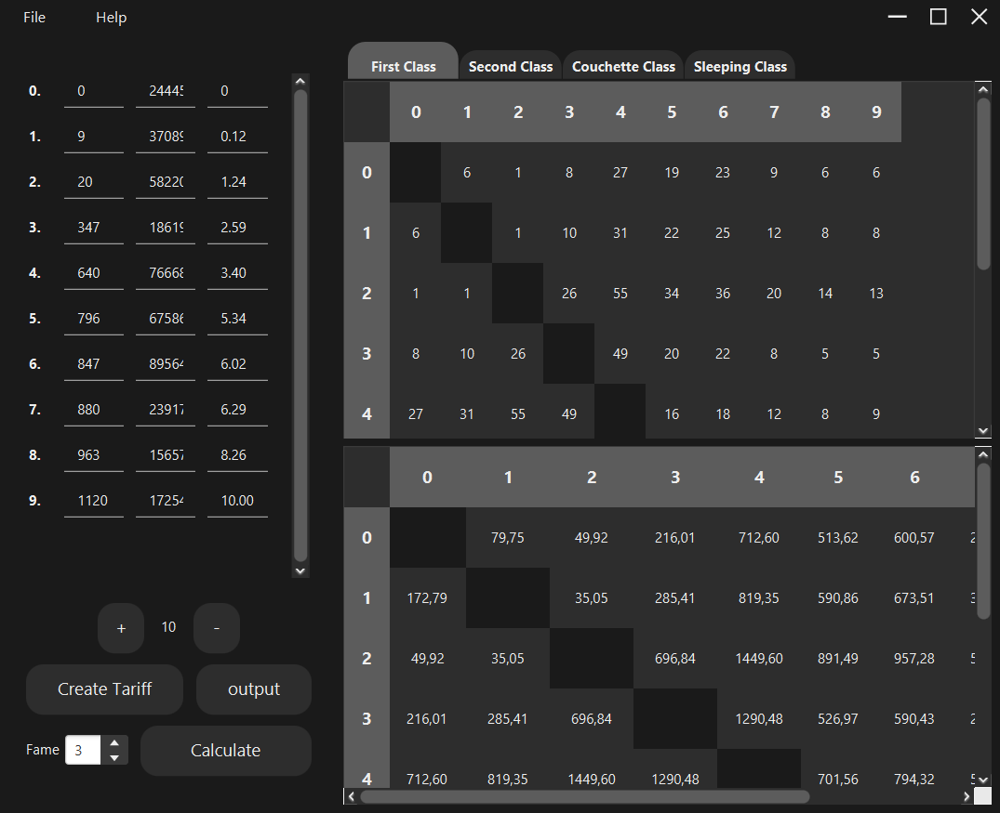
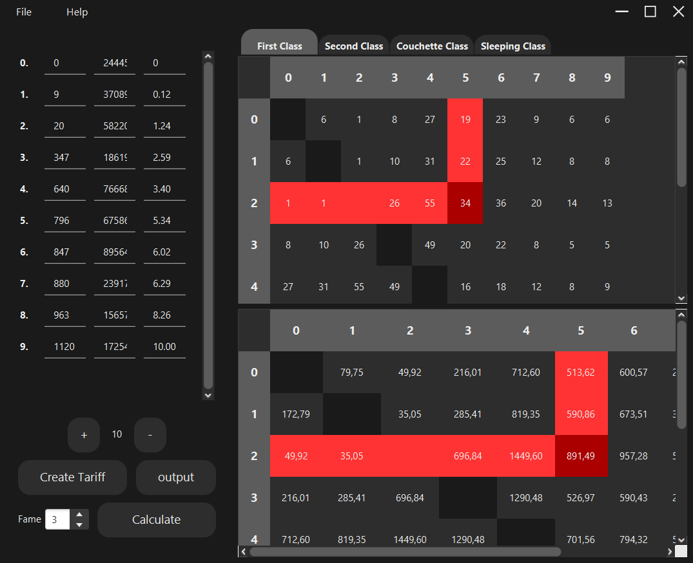
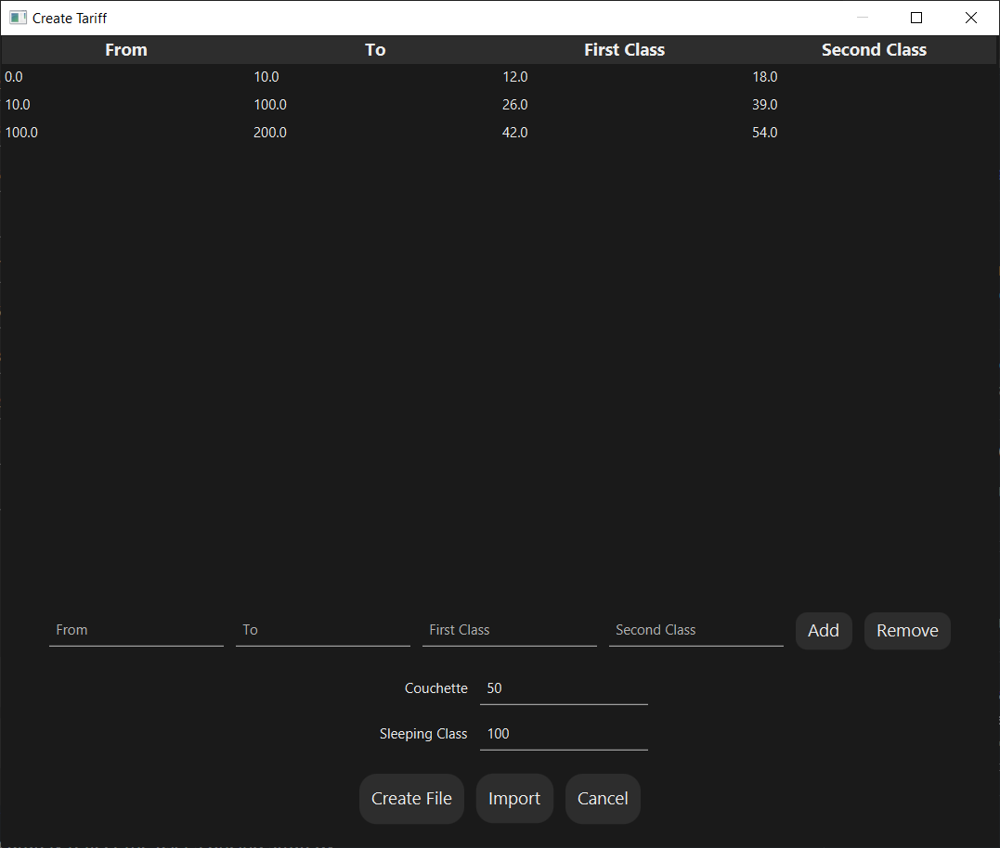

# CaclTrain

#### Kalkulator Zapotrzebowania na Trasy Pociągowe i Ceny Biletów
Ten projekt to aplikacja oparta na języku Java, zaprojektowana do obliczania zapotrzebowania na różnych trasach pociągowych i określania optymalnych cen biletów. Jest przeznaczony dla użytkowników gry [Railway Manager](https://sites.google.com/view/kolejowe-eg/strona-główna).



Aplikacja uwzględnia czynniki, takie jak liczba pasażerów, odległość trasy i czas przyjazdu, aby generować przepływy pasażerów dla każdej lini kolejowej. Potoki pasażerów stanowią podstawę do obliczania zapotrzebowania na każdą trasę, która jest reprezentowana w pierwszej macierzy. Ponadto aplikacja oblicza potencjalne przychody, jakie gracz może wygenerować na każdej trasie, co jest przedstawione w drugiej macierzy.

Ponadto użytkownicy mają możliwość tworzenia niestandardowego taryfikatora dla swojej firmy w grze. Dzięki temu przewidywane zarobki dokładnie odzwierciedlają strategię cenową użytkownika.

## Jak zacząć
Najpierw upewnij się, że wszystkie niezbędne dane do obliczeń są wpisane. Jeśli nie masz taryfikatora, możesz go utworzyć (obraz 4) lub użyć domyślnego pliku `output.json`.



Po wprowadzeniu wszystkich danych kliknij przycisk `Calculate`, aby obliczyć zapotrzebowanie i ceny.



Dwa wynikowe wykresy przedstawiają obliczone zapotrzebowanie [osoba/trasa] (góra) oraz ceny biletów (dół) na podstawie podanej odległości, populacji i czasu. Możesz zaznaczyć dowolną komórkę w obu wykresach, aby ułatwić odczyt danych.



Kliknięcie przycisku `Tariff` otwiera okno do tworzenia pliku JSON. Tutaj możesz użyć przycisków `Add` lub `Remove`, aby dodać lub usunąć rekordy z tabeli. Dane w dowolnym polu można modyfikować wedle uznania. W tabeli musi być obecne przynajmniej jedno pole oraz dwa pola poniżej muszą zawierać wartość dla poprawnego utworzenia pliku JSON.



Po wstawieniu wszystkich niezbędnych danych, naciśnij przycisk `Create File`. Zostaniesz poproszony o wybranie nazwy i miejsca docelowego dla nowego pliku. Po utworzeniu nowy plik można od razu użyć do obliczeń.

## Wymagania
Ta aplikacja została zaprojektowana wyłącznie do działania na systemach operacyjnych Windows i nie obsługuje korzystania z różnych platform.

Przed uruchomieniem tego projektu musisz mieć zainstalowany na swoim komputerze Java i Java SDK (Software Development Kit). Minimalne wymagane wersje to **JDK 17** i **JRE 1.8**.

* `Java`: Możesz pobrać go ze [oficialnej strony Oracle](https://www.oracle.com/java/technologies/javase-jdk11-downloads.html). Upewnij się, że wybierasz wersję zgodną z systemem operacyjnym i architekturą Twojego komputera.
* `Java SDK`: Jeśli nie masz go zainstalowanego, możesz pobrać go ze [oficialnej strony Oracle](https://www.oracle.com/java/technologies/javase-jdk11-downloads.html). Ponownie, wybierz wersję zgodną z systemem operacyjnym i architekturą Twojego komputera.

Po zainstalowaniu Javy i Java SDK powinieneś móc uruchomić aplikację. Jeśli napotkasz problemy, możliwe, że będziesz musiał skonfigurować zmienną systemową `JAVA_HOME`:

Na systemie Windows:

* Kliknij prawym przyciskiem myszy na Mój komputer i wybierz Właściwości.
* Kliknij na Zaawansowane ustawienia systemu*.
* Kliknij na Zmienne środowiskowe.
* Kliknij na Nowa pod Zmiennymi systemowymi.
* Wpisz `JAVA_HOME` w polu Nazwa zmiennej.
* Wpisz ścieżkę do katalogu instalacji Java SDK w polu Wartość zmiennej (na przykład C:\Program Files\Java\jdk-11.0.1).
* Kliknij OK i uruchom ponownie komputer, aby zastosować zmiany.

## Uruchom lokalnie
Sklonuj projekt

```bash
git clone https://github.com/EagleBlood/CalcTrain
```

Przejdź do katalogu projektu

```bash
cd my-project
```

Zainstaluj zależności

```bash
mvn install
```

Start the application

```bash
mvn javafx:run
```
