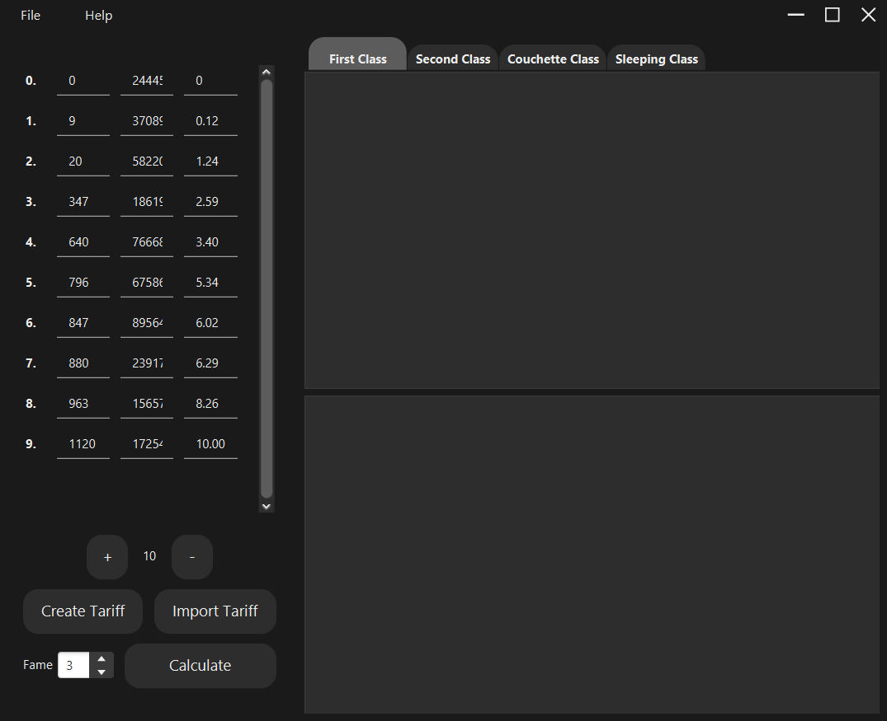
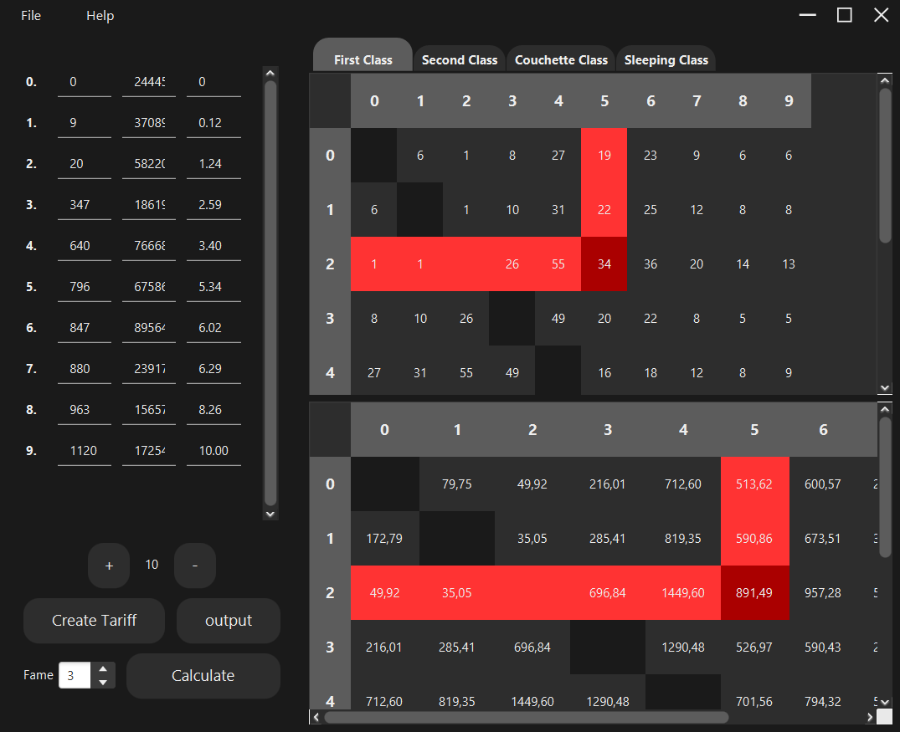
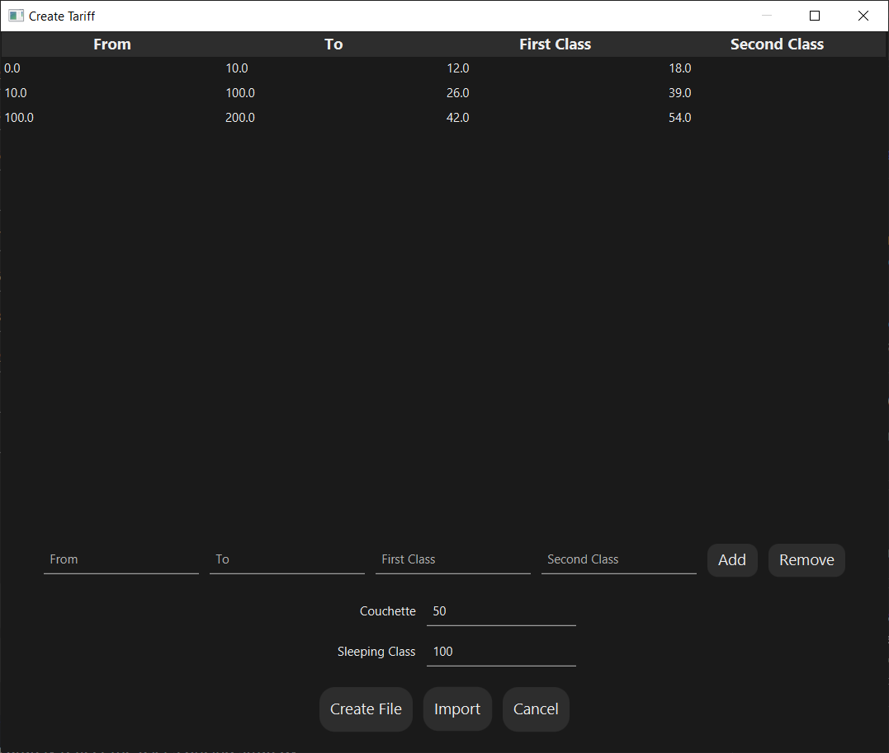

# CaclTrain

[](README-PL.md)

#### Train Route Demand and Ticket Pricing Calculator
This project is a Java-based application designed to calculate the demand on various train routes and determine the optimal ticket prices. It's built for players of the [Railway Manager](https://sites.google.com/view/kolejowe-eg/strona-główna) game.


The application incorporates various factors such as the number of passengers, route distance, and peak travel times to generate passenger flows for each train route. Passenger flows form the basis for calculating the demand for each route, which is represented in a first matrix. In addition, the application computes the potential revenue a player can generate on each route, which is depicted in a secondary matrix.

Furthermore, users have the ability to create a custom tariff for their in-game company. This feature ensures that the projected earnings accurately reflect the user's pricing strategy.

## How to use
First, ensure all necessary data for calculations is provided. If you don't have a valid tariff, you can create one (Image 4) or use the default `output.json` file.



Once all data has been inputted, click the `Calculate` button to compute the demand and prices.


The resulting two matrices display the calculated demand [person/route] (top) and ticket pricing (bottom) based on the given Distance, Population, and Time. You can highlight any cell in either matrix for easier data reading.



Clicking the `Tariff` button opens a window for creating a valid JSON file with all necessary fields. Here, you can use the `Add` or `Remove` buttons to add or remove records from the table. Data in any field can be modified at will. At least one field must be present in the table, and the two inputs below must contain a value for successful JSON creation.



After inserting all necessary data, press the `Create File` button. You will be prompted to choose a name and destination for the new file. Once created, this new file can be used immediately for calculations.


## Prerequisites
This application is designed to run on Windows operating systems only and does not support cross-platform usage.

Before you can run this project, you need to have Java and Java SDK (Software Development Kit) installed on your machine. The minimum required versions are **JDK 17** and **JRE 1.8**.

* `Java`: You can download it from the [official Oracle website](https://www.oracle.com/java/technologies/javase-jdk11-downloads.html). Make sure to choose the version that matches your operating system and architecture.
* `Java SDK`: If you don't have it installed, you can download it from the [official Oracle website](https://www.oracle.com/java/technologies/javase-jdk11-downloads.html). Again, choose the version that matches your operating system and architecture.

After installing Java and Java SDK, you should be able to run the application. If you encounter issues, you may need to set up the `JAVA_HOME` system variable:

On Windows:

* Right-click on My Computer and select Properties.
* Click on Advanced System Settings.
* Click on Environment Variables.
* Click on New under System Variables.
* For Variable name, enter `JAVA_HOME`.
* For Variable value, enter the path to your Java SDK installation directory (for example, C:\Program Files\Java\jdk-11.0.1).
* Click OK and restart your machine to apply the changes.

## Run Locally
Clone the project

```bash
git clone https://github.com/EagleBlood/CalcTrain
```

Go to the project directory

```bash
cd my-project
```

Install dependencies

```bash
mvn install
```

Start the application

```bash
mvn javafx:run
```
